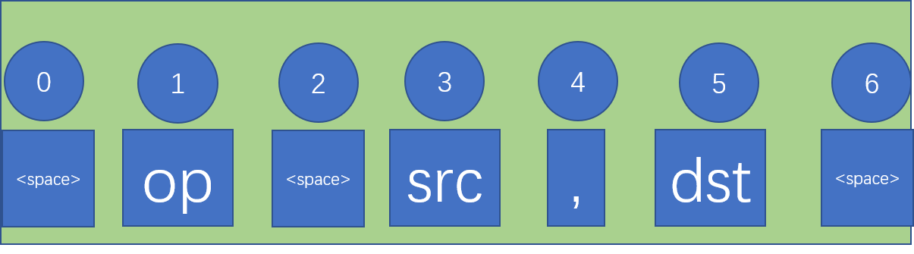
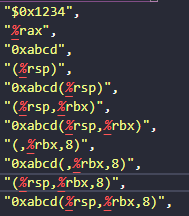
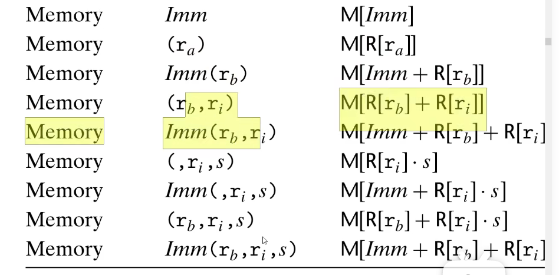
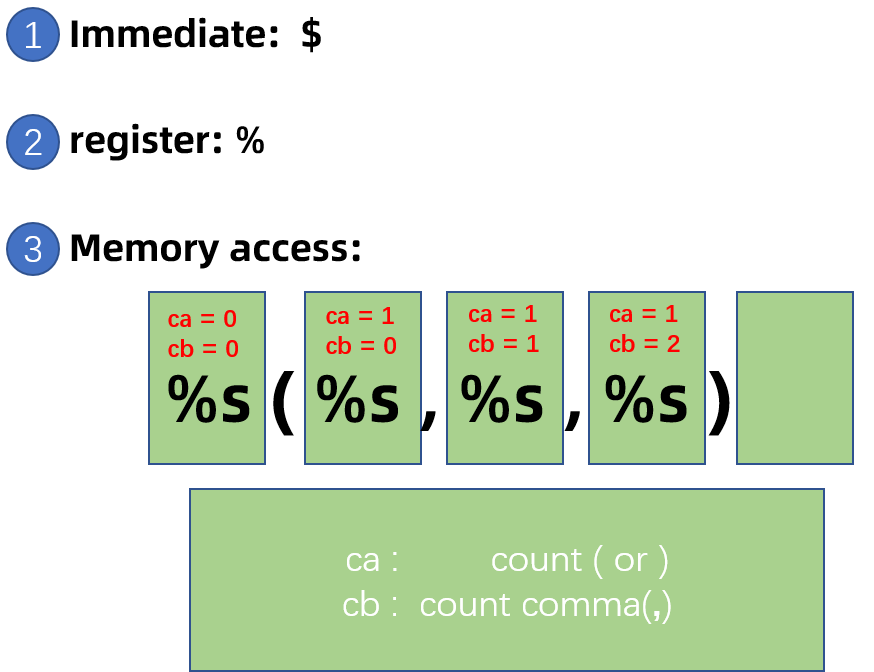
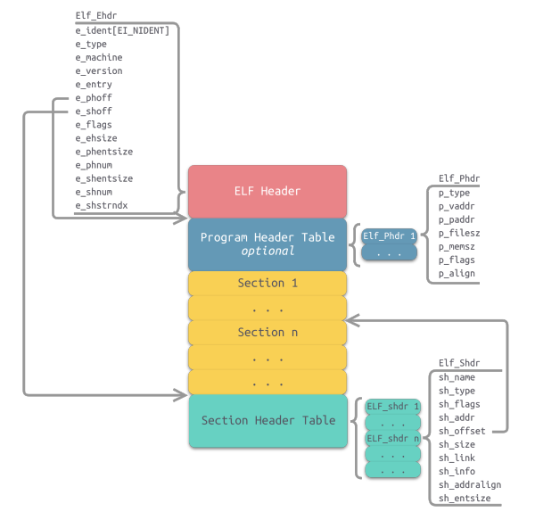
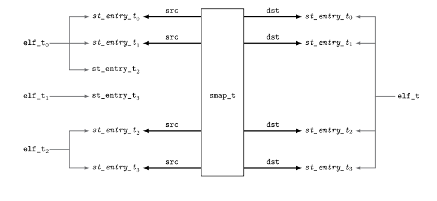

### 实现一个汇编模拟器

#### **第4节**

**结构体**：

cpu 

- 寄存器
- 用union低地址实现rax,eax,ax,al,ah
- 只有一个cpu

memory
- 空间大小

instruction
- 操作符
- 源操作数
- 目操作数
- 操作符定义枚举类型 枚举add,mov等
- 

操作数

- 操作数类型 (操作数的11种枚举类型)
- 立即数
- 乘数
- 寄存器1
- 寄存器2
- 操作数类型解码函数 od_decode

##### **第五节**

改：

cpu结构体不是很对，改名为register结构体

立即数改为有符号数

reg1和reg2改为指针

实现：

1. 指令周期函数实现一部分
   - void instruction_cycle()；

2. 用函数指针数组实现操作符的相应的动作
   - void init_handler_table();
   - add_reg_reg_handler();
   - init_handler_table();

3. 简单的虚拟内存到物理内存的转化
   - uint64_t va2pa(uint64_t vaddr)
4. 指令操作数decode_od(od_t od)的实现
5. 操作数add_reg_reg_handler(uint64_t src,uint64_t dst)的实现

#### 第六节

改：

uint64_t decode_od(od_t od)中不能直接返回imm,考虑到imm为负数

char code[100];应该放在inst_t里面

实现：

1. 操作数类型的填充 OP
2. OD_TYPE增加EMPTY，表示对寄存器啥也不做
3. 汇编指令的填写 program
4. 寄存器和内存的初始化，然后指令运行后，通过与gdb的调试后看是否match框架搭建 （验证程序写的正确性）

#### 第七节

改：

elf指令填写错误

由于内存是1个字节编址，不能根据地址写来写8个字节，要用函数实现

实现：

1. 内存读写64位

   uint64_t read64bits_dram(uint64_t paddr);

   void write64bits_dram(uint64_t paddr,uint64_t data);

2. 打印相关寄存器和内存的信息

   void print_register();

   void print_stack();

3. 实现call指令和mov指令

   void mov_reg_reg_handler(uint64_t src,uint64_t dst);//mov操作指令

   void call_handler(uint64_t src,uint64_t dst);//call操作指令

4. 成功调试好运行三条指令

#### 第八节

改：decode_od解码返回值改为地址

实现：

1. 指令 push
   - void push_reg_handler(uint64_t src,uint64_t dst);//push指令
2. 实现指令mov_reg_mem
   - void mov_reg_mem_handler(uint64_t src,uint64_t dst); //mov指令


#### 第九节

- 实现MOV PUSH POP RET CALL ADD指令 
- 第一次重构代码

```c
//convert.c
string2uint();//covert string to int64_t
uint32_t uint2float(uint32_t u);//convert uint32_t to its float

/******************************************************************/
//printf.c 调试打印
uint64_t debug_printf(uint64_t open_set, const char *format, ...);// wrapper of stdio printf

/******************************************************************/
//isa.c  //指令集处理
//op_t,od_type_t,od_t,inst_t 
static void parse_instruction(const char *str, inst_t *inst, core_t *cr);//处理汇编字符串，指令的翻译
static void parse_operand(const char *str, od_t *od, core_t *cr);//操作数的翻译
static uint64_t decode_operand(od_t *od);//返回操作数的数字
//各种指令集的函数
static void mov_handler             (od_t *src_od, od_t *dst_od, core_t *cr);
static void push_handler            (od_t *src_od, od_t *dst_od, core_t *cr);
static void pop_handler             (od_t *src_od, od_t *dst_od, core_t *cr);
static void leave_handler           (od_t *src_od, od_t *dst_od, core_t *cr);
static void call_handler            (od_t *src_od, od_t *dst_od, core_t *cr);
static void ret_handler             (od_t *src_od, od_t *dst_od, core_t *cr);
static void add_handler             (od_t *src_od, od_t *dst_od, core_t *cr);
static void sub_handler             (od_t *src_od, od_t *dst_od, core_t *cr);
static void cmp_handler             (od_t *src_od, od_t *dst_od, core_t *cr);
static void jne_handler             (od_t *src_od, od_t *dst_od, core_t *cr);
static void jmp_handler             (od_t *src_od, od_t *dst_od, core_t *cr);
static inline void reset_cflags(core_t *cr); //四个符号CF ,ZF , SF ,OF的清零
static inline void next_rip(core_t *cr); // PC + 1;
void instruction_cycle(core_t *cr);//负责执行指令周期
void print_register(core_t *cr);//打印寄存器
void print_stack(core_t *cr);//打印的栈的周围的数据

/******************************************************************/
//mmu.c 内存管理
uint64_t va2pa(uint64_t vaddr,core_t *cr);// 虚拟地址转化为物理地址


/******************************************************************/
//dram.c  DRAM 内存读写
uint64_t read64bits_dram(uint64_t paddr,core_t *cr); //一次性读64位
void write64bits_dram(uint64_t paddr, uint64_t data, core_t *cr);//一次性写64位
```

`common.h` 

1. 设置一些好读的debug宏定义
2. 一些要常见处理的函数定义

`cpu.h`

1. 把csapp的所有的寄存器都设置了
2. Program counter 从寄存器里面分开 与 四个flag放在一起
3. 增加了多核处理的扩充条件

`memory.h`

1. 设置内存的大小为65536字节
2. 内存读写的定义函数

`main_hardware.c`

1. 测试递归调用加法函数指令是否与gdb的运行一样

#### 第十次：

- 实现所有汇编指令的函数
- 将所有的汇编指令存入自己设置的物理内存，不用数组的存
- 递归累加和两数相加的测试汇编指令执行成功，与gdb调试的一样

#### 第十一节：总结做完的汇编的模拟器

static void parse_instruction(const char **str*, *inst_t* **inst*, *core_t* **cr*);

> 解析每一条指令，顺序遍历用状态转移存储op src  dst字符串
>
> 然后分别解析操作符字符串（op) 和操作数字符串（src和dst）



static void parse_operand(const char **str*, *od_t* **od*, *core_t* **cr*);

操作的数的类型很多，有11种如下图所示：





解析操作数的类型分为三种情况：

1. 立即数操作数： 以`$`开始
2. 寄存器操作数： 以`%`开始
3. 访问内存操作数：也是以状态转移进行解析操作数类型，以`括号数ca 和 逗号数 cb `进行状态划分进行解析



*uint64_t* string2uint_range(const char **str*,int *start*,int *end*)；

将字符串操作数转化为无符号数：也是状态转移进行划分进行解析，然后返回无符号数

状态转移如下图：


## 链接相关知识和链接器的实现

**链接程序的核心思想**：对一切未定义的数据与指令，我们提供一个有定义，但是对程序执行没有意义的地址，让每一个未被定义的数据与指令都引用一个有效地址。

**可执行可链接格式(Executable and Linkable Format,ELF)**

**可执行目标文件（Executable Object File,EOF)**

EOF文件基本格式：



1. **ELF Header**(64个字节)

   ```shell
   readelf -h a.o #用来查看elf header的信息
   ```

   ELF Header的数据结构

   ```c
   /* Type for a 16-bit quantity.  */
   typedef uint16_t Elf32_Half;
   /* Types for signed and unsigned 32-bit quantities.  */
   typedef uint32_t Elf32_Word;
   /* Type of addresses.  */
   typedef uint32_t Elf32_Addr;
   /* Type of file offsets.  */
   typedef uint32_t Elf32_Off;
   
   #define EI_NIDENT (16)
   typedef struct
   {
     unsigned char e_ident[EI_NIDENT];     /* Magic number and other info */
     Elf32_Half    e_type;                 /* Object file type */
     Elf32_Half    e_machine;              /* Architecture */
     Elf32_Word    e_version;              /* Object file version */
     Elf32_Addr    e_entry;                /* Entry point virtual address */
     Elf32_Off     e_phoff;                /* Program header table file offset */
     Elf32_Off     e_shoff;                /* Section header table file offset */
     Elf32_Word    e_flags;                /* Processor-specific flags */
     Elf32_Half    e_ehsize;               /* ELF header size in bytes */
     Elf32_Half    e_phentsize;            /* Program header table entry size */
     Elf32_Half    e_phnum;                /* Program header table entry count */
     Elf32_Half    e_shentsize;            /* Section header table entry size */
     Elf32_Half    e_shnum;                /* Section header table entry count */
     Elf32_Half    e_shstrndx;             /* Section header string table index */
   } Elf32_Ehdr;
   ```

   几个重要的说明：

   **Elf64_Ehdr.e_shoff :** 是SHT（Section Header Table)对ELF起始地址的Byte的偏置

   **Elf64_Ehdr.e_shentsize:** 描述SHT每一项的Byte大小

   **Elf64_Ehdr.e_ehsize：**ELF Header的字节大小

   **Elf64_Ehdr.e_shstrndx**：标记字符串节区的索引。如果为`00 0e`。也就是第14Section为字符节区。

   

2. 节头表SHT(Section Header Table)

   ```shell
   readelf -h a.o #用来查看Section Header Table的信息
   ```

   SHT描述了ELF中不同的节（Section）,其中包括数据节(.data)、代码节(.text)等。

   这些Section中的数据是由编译器生成的，按照Section的组织写入到磁盘上的ELF文件中。SHT的每一项可以被数据结构Flf64_Shdr所描述：

   ```c
   typedef struct
   {
     Elf64_Word	sh_name;		/* Section name (string tbl index) */
     Elf64_Word	sh_type;		/* Section type */
     Elf64_Xword	sh_flags;		/* Section flags */
     Elf64_Addr	sh_addr;		/* Section virtual addr at execution */
     Elf64_Off	sh_offset;		/* Section file offset */
     Elf64_Xword	sh_size;		/* Section size in bytes */
     Elf64_Word	sh_link;		/* Link to another section */
     Elf64_Word	sh_info;		/* Additional section information */
     Elf64_Xword	sh_addralign;		/* Section alignment */
     Elf64_Xword	sh_entsize;		/* Entry size if section holds table */
   } Elf64_Shdr;
   ```

   重要的解释：

   **Elf64_Shdr.sh_name:** 指向一个字符串表的索引，字符串表Section的索引在ELF Header中的**Elf64_Ehdr.e_shstrndx**可以找到;

   **Elf64_Shdr.sh_addr**:程序执行时section所在的虚拟地址

   **Elf64_Shdr.sh_offset**：这个section在ELF文件内的偏移位置

   **Elf64_Shdr.sh_offset**：这个section所占的字节大小

   

3. 符号表（Symbol Table）

   > 这里不讨论函数内的局部变量，因为函数内部的局部变量是由函数栈来管理

   局部符号(Local Symbol)或静态符号(Static Symbol):其被static修饰，只对同一个模块内的函数可见。

   全局符号(Global Symbol):没有被static修饰的，是普通的全局符号，对所有的模块可见，被extern修饰的，说明在当前的源文件没有定义，而只在extern处有声明，方便当前源文件中的函数对它进行引用；

   符号表的表项的数据结构如下：

   ```c
   typedef struct
   {
     Elf64_Word	st_name;		/* Symbol name (string tbl index) */
     unsigned char	st_info;		/* Symbol type and binding */
     unsigned char st_other;		/* Symbol visibility */
     Elf64_Section	st_shndx;		/* Section index */
     Elf64_Addr	st_value;		/* Symbol value */
     Elf64_Xword	st_size;		/* Symbol size */
   } Elf64_Sym;
   ```

    **Elf64_Sym.st_name**:指向一个字符串表的索引，字符串表Section的索引在ELF Header中的**Elf64_Ehdr.e_shstrndx**可以找到;

    **Elf64_Sym.st_shndx**:该符号在哪一个Section；

    **Elf64_Sym.st_value**:这个符号在这个Section的偏移位置

    **Elf64_Sym.st_size**:这个符号在这个Section的大小

   

   

   **Elf64_Sym.st_info**: 8个Bits被分为两个部分：低4位的被解释为符号的类型(Type),高4位为符号在源文件中的关联(Bind);

   Bind常见的三种取值：

   ```c
   #define STB_LOCAL	0		/* Local symbol */
   #define STB_GLOBAL	1		/* Global symbol */
   #define STB_WEAK	2		/* Weak symbol */
   ```

   Type常见的三种取值：

   ```c
   #define STT_NOTYPE	0		/* Symbol type is unspecified */
   #define STT_OBJECT	1		/* Symbol is a data object */
   #define STT_FUNC	2		/* Symbol is a code object */
   ```

   

4. 符号解析

   > 符号解析是我们做静态链接的第一步，当所有的ELF文件读入内存以后，我们面临的一个问题：不同的文件可能声明了同名的符号，符号解析需要解决这样的声明冲突。

   全局符号三种类型:有定义（Defined),临时定义（Tentative)、未定义(Undefined)

   - 有定义的符号是指该符号在ELF文件中有确定的位置(.text .rodata .data .bss),用来存储它的值
   - 临时定义是指该符号没有确定的存储空间，通常也就是COMMON节中的全局变量，因为我们在编译不能确定该变量最终属入.data或是.bss，因此它是临时定义。
   - 未定义的符号也就是没有存储空间的符号，也就是Elf64_Sym.shndex为SHN_UNDEF

   通常Defined为强符号（Strong Symbol） Tentative、Weak Bind、Undefined是弱符号（Weak Symbol)

   

   由于ELF合并有相同的符号时候的三种规则：

   1. 只允许存在一个符号为Defined,也即强符号，并且选择该强符号
   2. 多个弱符号与一个强符号共同存在，选择强符号
   3. 只有多个弱符号，选择优先程度最高的；优先程度相同时，任意选择一个弱符号

5. Section合并

   实现符号解析以后，我们还需要将相同类型的Section进行重定位与合并。这一步处理所有被解析过的符号，根据他们所属的Section，将符号放在同一个Section中。至此，我们便可以确定该Section在EOF中位置的大小，重新确定符号在Section的位置和大小了。也可以计算出运行时的虚拟地址0x00400000开始。.text是从虚拟内存0x00400000开始的。

6. 外部引用的重定位

   > 完成符号处理以及Section的合并以后，我们已经获得了囊括EOF的雏形，在此基础上需要对符号与引用进行重定位（Relocation).

   ```c
   typedef struct
   {
     Elf64_Addr	r_offset;		/* Address */
     Elf64_Xword	r_info;			/* Relocation type and symbol index */
     Elf64_Sxword	r_addend;		/* Addend */
   } Elf64_Rela;
   ```

   两种类型进行说明：

   PC相对寻址(R_X86_64_PC32)：

   [S]被引用的位置，[P]写入的位置，[A]为r_addend为矫正值

   **修改的值为 ： S + A - P**

   PC绝对寻址(R_X86_64_32)：

   **修改的值为： S + A**

## 文本静态链接的实现

ELF.txt解析：

```text
// unsigned long long sum(unsigned long long *a, unsigned long long n);
// unsigned long long array[2] = {0x12340000, 0xabcd};
// unsigned long long bias = 0xf00000000;
// unsigned long long main()
// {
//     unsigned long long val = sum(array, 2);
//     return val;
// }

// link process:
// gcc-7 -c main.c -o main.o
// gcc-7 -c sum.c -o sum.o
// ld main.o sum.o -e main -o program

// ------------------------------- //
// elf file content
// ------------------------------- //

// lines of elf file (witout comments and white line): [0] - [0]
25

// lines of the following section header tables: [1] - [1]
4

// section header
// sh_name,sh_addr,sh_offset,sh_size
.text,0x0,6,10
.data,0x0,16,3
.symtab,0x0,19,4
.rel.text,0x0,23,2

// .text
// main()
push   %rbp
mov    %rsp,%rbp
sub    $0x10,%rsp
mov    $0x2,%esi
lea    0x0000000000000000(%rip),%rdi    // 14 <main+0x14>
callq  0x0000000000000000   // <main+0x19>, place holder for sum
mov    %rax,-0x8(%rbp)
mov    -0x8(%rbp),%rax
leaveq
retq

// .data
0x0000000012340000  // array[0]
0x000000000000abcd  // array[1]
0x0000000f00000000  // bias

// .symtab
// st_name,bind,type,st_shndex,st_value,st_size
array,STB_GLOBAL,STT_OBJECT,.data,0,2
bias,STB_GLOBAL,STT_OBJECT,.data,2,1
main,STB_GLOBAL,STT_FUNC,.text,0,10
sum,STB_GLOBAL,STT_NOTYPE,SHN_UNDEF,0,0

// .rel.text
// r_row,r_col,type,sym,r_addend
4,7,R_X86_64_PC32,0,-4// array, we don't know array's run-time addr
5,7,R_X86_64_PLT32,3,-4// sum
```

【1】：表示文件的总行数

【2】：表示Section Header Table 的个数

【3】- 【6】：SHT

解析Section Header Table存放在结构体中：

```c

typedef struct
{
    char sh_name[MAX_CHAR_SECTION_NAME];
    uint64_t sh_addr;
    uint64_t sh_offset;     // line offset or effective line index
    uint64_t sh_size;
} sh_entry_t;
```

.text段

.rodata与.data一样，为了方便，我们将所有的数值对齐与扩展为64Bits,每一行记一个16进制数：

```c
0x0000000012340000  // array[0]
0x000000000000abcd  // array[1]
0x0000000f00000000  // bias
```

.symtab的结构体与枚举类型如下:

```c
typedef enum
{
    STB_LOCAL,
    STB_GLOBAL,
    STB_WEAK
} st_bind_t;

typedef enum
{
    STT_NOTYPE,
    STT_OBJECT,
    STT_FUNC
} st_type_t;

typedef struct
{
    char st_name[MAX_CHAR_SECTION_NAME];
    st_bind_t bind;
    st_type_t type;
    char st_shndx[MAX_CHAR_SECTION_NAME];
    uint64_t st_value;      // in-section offset
    uint64_t st_size;       // count of lines of symbol
} st_entry_t;
```

重定位给出了rel.text以及.rel.data的结构为：

```c
typedef enum
{
    R_X86_64_32,
    R_X86_64_PC32,
    R_X86_64_PLT32,
} reltype_t;
// relocation entry type
typedef struct
{
    /*  this is what's different in our implementation. instead of byte offset, 
        we use line index + char offset to locate the symbol */
    uint64_t    r_row;      // line index of the symbol in buffer section
                            // for .rel.text, that's the line index in .text section
                            // for .rel.data, that's the line index in .data section
    uint64_t    r_col;      // char offset in the buffer line
    reltype_t   type;       // relocation type
    uint32_t    sym;        // symbol table index
    int64_t     r_addend;   // constant part of relocation expression
} rl_entry_t;
```


文本解析：从磁盘被读入的.elf.txt被结构体elf_t所描述：

````c
void parse_elf(char *filename, elf_t *elf);
````

```c
typedef struct
{
    char buffer[MAX_ELF_FILE_LENGTH][MAX_ELF_FILE_WIDTH];
    uint64_t line_count;

    uint64_t sht_count;
    sh_entry_t *sht;

    uint64_t symt_count;
    st_entry_t *symt;

    
    uint64_t reltext_count;
    rl_entry_t *reltext;

    uint64_t reldata_count;
    rl_entry_t *reldata;
} elf_t;
```

**符号解析：**

link_elf的第一步工作是进行符号解析。我们需要扫描所有 ELF文件，对每一个文件扫描他的符号表，然后将这些符号存储在一个内部的符号表中。这个**内部的符号表**可以轻易的转化为EOF最终的符号表；

```c
void link_elf(elf_t **srcs, int num_srcs, elf_t *dst);
```

这个内部的符号表需要比EOF的.symtab存储更多的信息，方便我们合并Section和对符号的引用的重定位。为此，设计的内部符号表的结构如下：

```c
// internal mapping between source and destination symbol entries
typedef struct
{
    elf_t       *elf;   // src elf file
    st_entry_t  *src;   // src symbol
    st_entry_t  *dst;   // dst symbol: used for relocation - find the function referencing the undefined symbol
} smap_t;
```

这个数据结构建立了多个输入ELF与输出EOF文件之间建立的映射关系:



```c
static void symbol_processing(elf_t **srcs, int num_srcs, elf_t *dst,
    smap_t *smap_table, int *smap_count);
static void simple_resolution(st_entry_t *sym, elf_t *sym_elf, smap_t *candidate);
```

函数symbol_processing和simple_resolution用来完成符号解析。遍历每一个输入的ELF文件，以及该ELF文件的符号表elf_t.symt,对符号表项与当前缓存在smap_t中的符号进行对比，一旦发现同名的全局符号，则进行对比两者的优先程度，进行符号解析;

**Section合并：**

.text段运行时的虚拟地址从0x00400000开始，这里就知道每一个segment的运行地址了。

```c
static void compute_section_header(elf_t *dst, smap_t *smap_table, int *smap_count);
```

ELF中 的Section合并为EOF中的Segment,我们首先需要计算

- EOF全文本的行数line_count
- SHT的行数sht_count,以及SHT本身，并且将这几个结果写入文本buffer

```c
static void merge_section(elf_t **srcs, int num_srcs, elf_t *dst,
    smap_t *smap_table, int *smap_count);
```

接着，按照EOF的SHT中Segment的顺序，将所有ELF的各个Section合并为Segment.遍历ELF文件，遍历ELF文件的符号表，对比smap_t中缓存的映射，将会被写入EOF的符号合并到EOFbuffer中；

**符号引用的重定位：**

```c
static void relocation_processing(elf_t **srcs, int num_srcs, elf_t *dst,
    smap_t *smap_table, int *smap_count);
static uint64_t get_symbol_runtime_address(elf_t *dst,st_entry_t *sym);
```

调用函数relocation_processing时，我们已经将各个ELF文件的Section合并为Segment了，与此同时，我们也可以确定到EOF各个Segment加载到内存以后的运行时地址。因此，每一个符号运行时地址，我们

也可以计算得到；

简化模型（定长的指令和数据）：

- inst_t作为指令的类型

- uint64_t作为数据类型

通过rl_entry_t.r_row和rl_entry_t.r_col计算发送符号引用的位置；根据rl_entry_t.sym在smap_table中查找所引用的符号sym,计算到sym的运行时的地址。最后根据rl_entry_t.type，按照PC相对寻址或者绝对寻址，将sym的运行时地址写入发生引用的位置，就完成了重定位。

**Static-linker链接器就完成了~！**
